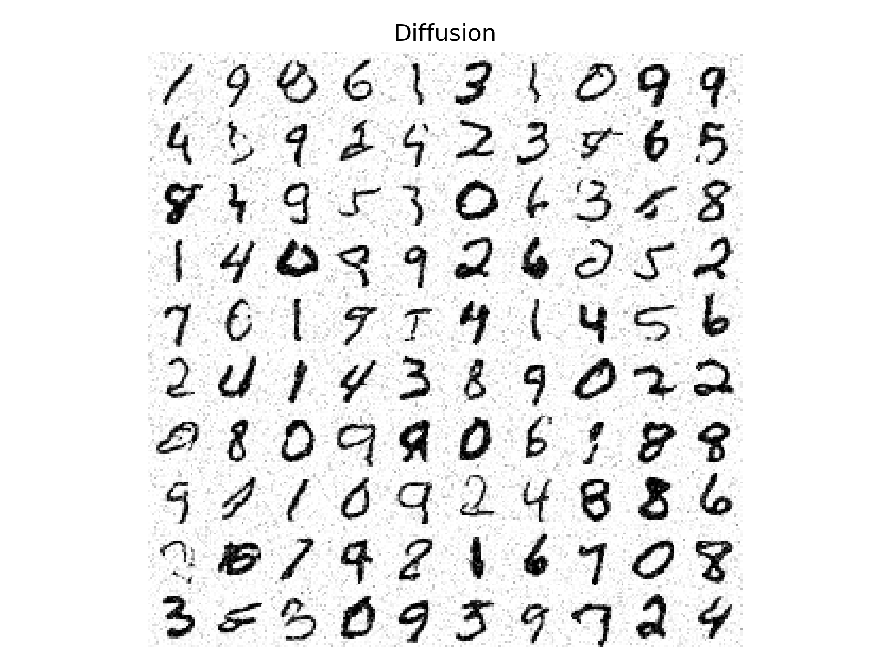
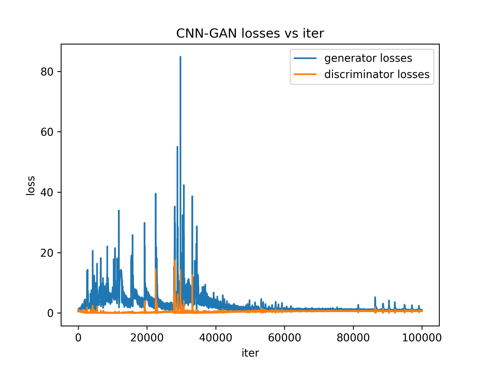
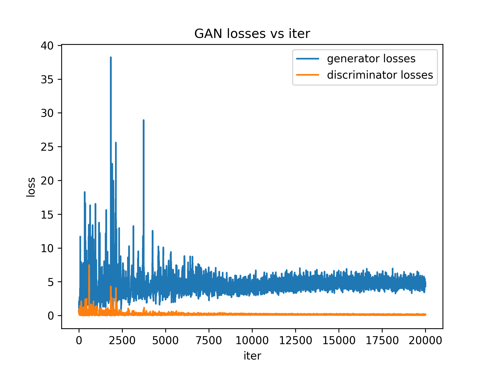

# Benchmarking of Generative Vision Models

Generative models are difficult to train and tune, without exact criteria. Thus, exploring a straight forward pipeline for generative modeling, tuning and benchmarking. Within purview of this (personal) exploration:

1. Build models with different structures for MNIST type digit image generation. 
2. Build models of different sizes - A small GAN and a large GAN
3. Build a custom benchmark - FID benchmark for MNIST type image generation.
4. Do all of this in Jax.

## Diffusion model:
Generated samples:

Training losses:

Influenced by this [implementation](https://docs.kidger.site/equinox/examples/score_based_diffusion/) of score based diffusion, with modification for personal hardware, score function, hyperparameters, and some minor structure modifictions.

Quoting:

- Uses the variance-preserving SDE to corrupt the data:

$y(0) \sim \mathrm{data}\qquad\mathrm{d}y(t) = -\frac{1}{2} β(t)y(t)\mathrm{d}t + \sqrt{β(t)}\mathrm{d}w(t) \qquad\text{for }t \in [0, T].$

- Trains a score model $s_\theta$ according to the denoising objective:

$\arg\min_\theta \mathbb{E}_{t \sim \mathrm{Uniform}[0, T]}\mathbb{E}_{y(0) \sim \mathrm{data}}\mathbb{E}_{(y(t)|y(0)) \sim \mathrm{SDE}} \lambda(t) \| s_\theta(t, y(t)) - \nabla_y \log p(y(t)|y(0)) \|_2^2$

## CNN-GAN model: 
Generated samples:

Training losses:

Inspired by this [implementation](https://docs.kidger.site/equinox/examples/deep_convolutional_gan/) but modified structured for 28 x 28 MNIST instead of 64 x 64, modified training process and model structure like activations.

## Mini-GAN model: 
Generated samples:

Training losses:

Small MLP-GAN for basic control. (Also to analyze the training pathologies of GANs in a smaller domain). Based on my own [torch implementation](https://github.com/AbhinavRao23/conditionalGANs). 

